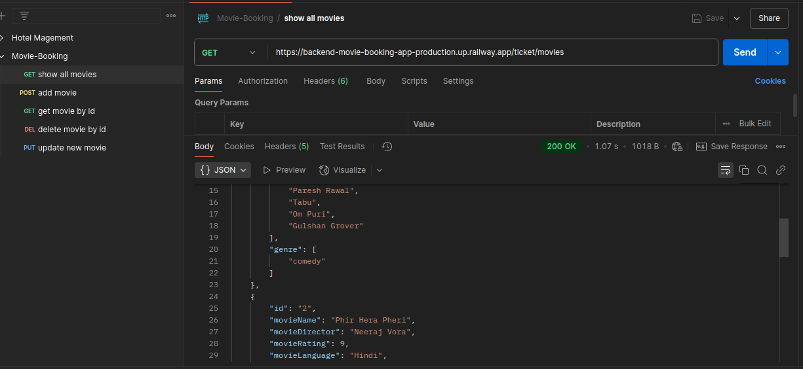

# Movie Booking Application (Backend)

**Get a List of All Available Movies:** https://backend-movie-booking-app-production.up.railway.app/ticket/movies

**Overview**
This is a Spring Boot-based Movie Booking Application that allows users to manage movies in the system. Users can:

- View all available movies
- Add a new film with a unique ID
- Retrieve movie details by ID
- Delete a movie by ID
- Update movie details by ID

You can test all endpoints using Postman.

**Hosting**
My mini backend project is hosted on Railway.com. 

**API Endpoint Structure**
The base URL for all endpoints is https://backend-movie-booking-app-production.up.railway.app/ticket. The structure for the different API endpoints is as follows:

- **GET /movies:** Retrieve a list of all available movies
- **POST /movie:** Add a new movie
- **GET /movie/{id}:** Retrieve movie details by ID
- **DELETE /movie/{id}:** Delete a movie by ID
- **PUT /movies/{id}:** Update movie details by ID

**Example:** To get a list of all available movies, use the following URL: "https://backend-movie-booking-app-production.up.railway.app/ticket/movies"

**Error Handling**
The application includes error handling for:
- Duplicate IDs when adding movies
- Non-existent movies when retrieving or deleting
- Validation for movie name, ID, and director

**Setup Instructions**
1. Clone the repository.
2. Run `mvn install` to install the necessary dependencies.
3. Start the Spring Boot application using `mvn spring-boot:run`.
4. Access the API at https://backend-movie-booking-app-production.up.railway.app/ticket/movies.
